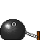

#  Confabulation, Hallucinations & Overgeneration in Multilingual and Practical Settings (CHOMPS 2025)

The workshop is intended to be colocated with [IJCNLP-AACL 2025](https://www.afnlp.org/conferences/ijcnlp2025/), happening on December 23-24, 2025, in Mumbai, India.

---

##  Scope of the workshop
The aim of the **CHOMPS** workshop is to find ways to mitigate one of major the hurdles that currently prevent the adoption of Large Language Models in real-world scenarios: namely, their tendency to hallucinate, i.e., produce unsupported and unverifiable text that sounds deceptively plausible. 

The workshop will explore **hallucination mitigation** in practical situations, where this mitigation is crucial: in particular,  precision-critical applications (such as those in the medical, legal and biotech domains), as well as multilingual settings (given the lack of resources available to reproduce what can be done for English in other linguistic contexts). In practice, we intend to invite works of the following (not exclusive) list of topics:

- Metrics, benchmarks and tools for hallucination detection; 

- Factuality challenges in mission critical & domain-specific (e.g., medical, legal, biotech) and their consequences on societal, engineering and practical levels;

- Mitigation strategies during inference or model training; 

- Studies of hallucinatory and confabulatory behaviors of LLMS in cross-lingual and multilingual scenarios; 

- Confabulations in language & multimodal (vision, text, speech) models.

- Perspectives and case studies from other disciplines

- …

##  Keynote Speakers

_TBA_

##  Organizers

- Aman Sinha, Université de Lorraine, Nancy, France
- Timothee Mickus, University of Helsinki, Finland
- Raul Vazquez, University of Helsinki, Finland
- Rohit Agarwal, UiT Tromsø, Norway
- Ioana Buhnila, Université de Lorraine, Nancy, France
- Patricia Schmidtova
- Jorg Tiedmann, University of Helsinki, Finland
- 

##  Scientific Committee

_TBA_

##  Acknowledgements

The website is inspired by the [shadcn/ui](https://ui.shadcn.com/) website. 
